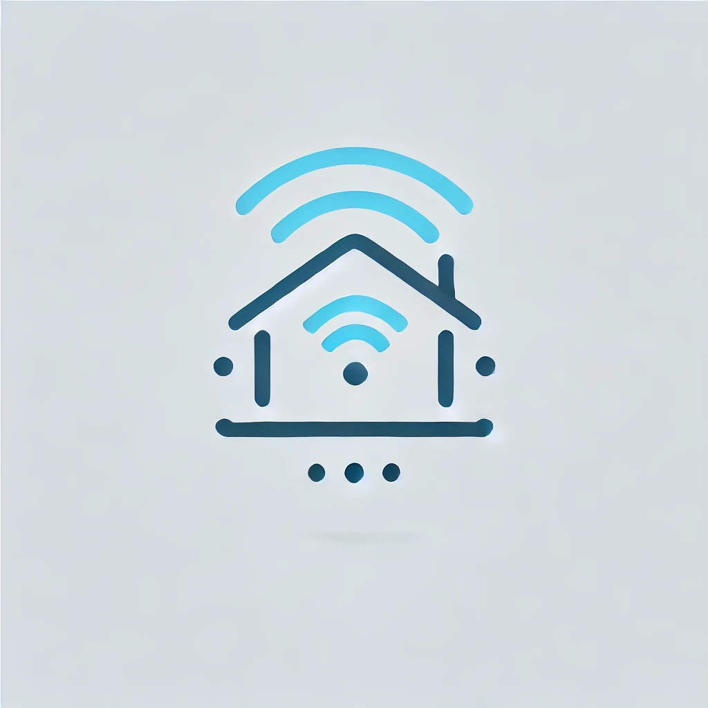

# MyESPHome

| Repository Status | myESPhome Repo |
| :--- | :--- |
|  [![last commit time][github-last-commit]][github-master] [![GitHub Activity][commits-shield]][commits] |   |
| [![License][license-shield]](LICENSE) [![Forks][forks-shield]][forks-url] [![Stargazers][stars-shield]][stars-url] [![Issues][issues-shield]][issues-url] | [![Contributors][contributors-shield]][contributors-url]  |
|  | |

|   |

## myESPhome Projects

<!-- @import "[TOC]" {cmd="toc" depthFrom=1 depthTo=6 orderedList=false} -->

## Intro

Welcome to MyESPHome - a collection of ESPHome projects designed to make ESP board integration with Home Assistant easier and more accessible.

This repository contains ready-to-use ESPHome configurations for various sensors and devices, along with a web interface that allows you to flash firmware directly to your ESP boards using your browser.

## How to Use

### Option 1: Web Interface (Recommended)

Visit our website at [https://myesphome.assistantathome.nl/](https://myesphome.assistantathome.nl/) where you can:

1. **Browse available projects** - Select from various pre-configured devices
2. **Connect your ESP board** - Use the "Connect & Install Firmware" button to flash directly via your browser
3. **No installation required** - Everything works through WebSerial in modern browsers (Chrome/Edge 89+, Firefox with experimental features)

### Option 2: Manual Installation

1. **Download the YAML files** from the `esphome/` folder
2. **Customize the configuration** to match your setup (WiFi credentials, device names, etc.)
3. **Compile and upload** using ESPHome CLI or Home Assistant ESPHome integration

### Prerequisites

- ESP32 or ESP8266 board
- USB cable for initial flashing
- Modern web browser with WebSerial support (Chrome/Edge 89+ recommended)
- Home Assistant with ESPHome integration (for device management)

### List of all devices in this project

- Luxmeter (operational)
- Bluetooth proxy (operational)
- Garage door opener (coming soon)
- IKEA Air Quality Meter (coming soon)

## Project Details

### Luxmeter

A light sensor project using the BH1750 sensor to measure ambient light levels in lux.

**Features:**

- Accurate light measurement (1-65535 lux)
- Auto-discovery in Home Assistant
- Low power consumption
- I2C interface

**Use cases:**

- Automatic lighting control
- Garden/greenhouse monitoring
- Security lighting automation
- Energy saving applications

#### Parts List

| Description | Quantity | Notes |
| :--- | :---: | :--- |
| WEMOS D1 Mini | 1 | ESP8266-based development board |
| BH1750 sensor | 1 | Digital light intensity sensor |
| Jumper wires | 4 | For I2C connections |
| Breadboard (optional) | 1 | For prototyping |

> **Note:** Some earlier documentation or sources may refer to the 'BH1780' sensor, but the correct model for this project is the 'BH1750' digital light sensor.

#### Wiring

| BH1750 | WEMOS D1 Mini |
| :--- | :--- |
| VCC | 3.3V |
| GND | GND |
| SCL | D1 (GPIO5) |
| SDA | D2 (GPIO4) |

#### Pinout

### Bluetooth Proxy

Turn your ESP32 into a Bluetooth proxy for Home Assistant, extending the range of your Bluetooth devices.

**Features:**

- Bluetooth LE proxy functionality
- Extends Home Assistant's Bluetooth range
- Auto-discovery in Home Assistant
- Works with ESP32 only (Bluetooth LE required)

**Use cases:**

- Extend Bluetooth coverage throughout your home
- Bridge Bluetooth devices to Home Assistant
- Monitor Bluetooth beacons and sensors
- Support for Xiaomi, Govee, and other Bluetooth sensors

**Compatible devices:**

- ESP32 (any variant with Bluetooth LE)
- ESP32-C3, ESP32-S3, ESP32-S2

## Getting Started

1. **Visit the website**: Go to [https://myesphome.assistantathome.nl/](https://myesphome.assistantathome.nl/)
2. **Select your project**: Choose from the available device configurations
3. **Connect your ESP**: Click "Connect & Install Firmware" and select your device
4. **Configure**: Update WiFi credentials and device settings as needed
5. **Add to Home Assistant**: The device will automatically appear in Home Assistant

## Contributing

We welcome contributions! Here's how you can help:

- **Submit new device configurations** by creating a pull request
- **Report issues** if you find bugs or have suggestions
- **Improve documentation** by enhancing README files or adding examples
- **Test configurations** on different hardware setups

### Adding a New Device

1. Fork this repository
2. Create your ESPHome YAML configuration in the `esphome/` folder
3. Add corresponding package files in `esphome/package/` if needed
4. Update the build workflow in `.github/workflows/build.yml`
5. Test your configuration
6. Submit a pull request with a clear description

## Troubleshooting

### Web Installation Issues

#### "WebSerial not supported"

- Use Chrome/Edge 89+ or Firefox with `dom.serial.enabled` set to true
- Ensure you're accessing the site via HTTPS

#### Device not detected

- Check USB cable (data cable, not power-only)
- Try a different USB port
- Install ESP32/ESP8266 drivers if needed

#### Upload fails

- Put ESP in download mode (hold BOOT button while connecting)
- Check if another program is using the serial port
- Try a different USB cable

### Home Assistant Integration

#### Device not appearing

- Ensure ESP and Home Assistant are on the same network
- Check ESPHome integration is installed
- Verify device is connected to WiFi (check router/ESPHome logs)

#### Connection issues

- Verify WiFi credentials in the configuration
- Check firewall settings
- Ensure mDNS is working on your network

## Resources

- **ESPHome Documentation**: [https://esphome.io](https://esphome.io)
- **Home Assistant**: [https://www.home-assistant.io](https://www.home-assistant.io)
- **ESP Web Tools**: [https://esphome.github.io/esp-web-tools/](https://esphome.github.io/esp-web-tools/)
- **ESPHome Discord**: Join the community for support and discussions

## License

This project is licensed under the MIT License - see the [LICENSE](LICENSE) file for details.

## Support

You can contact me in several ways.

### GitHub

Create an "issue" and I will respond as quickly as possible.

### Discord

I am an active member of the Huizebruin Domotica Community Discord group. If you have any questions, you can always join this channel and contact me (schmm).
You can also connect with other Home Assistant users!

[![Discord][discord-shield]][discord]

### E-mail

You can also always send me an email at myesphome@[tobedetermined].nl. I will respond as quickly as possible and will always try to respond within 2 business days.

[commits-shield]: https://img.shields.io/github/commit-activity/m/scns/myESPhome.svg
[discord]: https://discord.gg/hKPgwWNHwH
[discord-shield]: https://img.shields.io/discord/723629686093119650.svg?logo=discord&color=7289da
[commits]: https://github.com/scns/myESPhome/commits/main
[github-last-commit]: https://img.shields.io/github/last-commit/scns/myESPhome.svg?style=plasticr
[github-master]: https://github.com/scns/myESPhome/commits/main
[license-shield]: https://img.shields.io/github/license/scns/myESPhome.svg
[contributors-url]: https://github.com/scns/myESPhome/graphs/contributors
[contributors-shield]: https://img.shields.io/github/contributors/scns/myESPhome.svg
[forks-shield]: https://img.shields.io/github/forks/scns/myESPhome.svg
[forks-url]: https://github.com/scns/myESPhome/network/members
[stars-shield]: https://img.shields.io/github/stars/scns/myESPhome.svg
[stars-url]: https://github.com/scns/myESPhome/stargazers
[issues-shield]: https://img.shields.io/github/issues/scns/myESPhome.svg
[issues-url]: https://github.com/scns/myESPhome/issues
